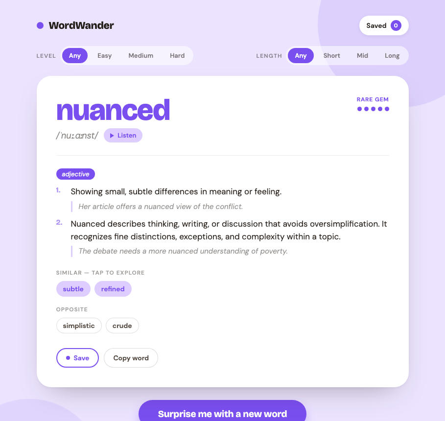

# WordWander

A vocabulary discovery app — surprise yourself with a new word, hear it, explore
its synonyms/antonyms, and save the ones you love. Built from the WordWander
design as a **Vue 3 + TypeScript** frontend talking to a **NestJS + SQLite**
backend.



## Architecture

```
my-app/
├── backend/            NestJS API (SQLite via better-sqlite3)
│   └── src/
│       ├── database/   Connection + schema (words = dictionary cache)
│       ├── dictionary/ Free Dictionary API client + normalizer
│       ├── words/      Curated word pool + cache-or-fetch resolution
│       ├── favorites/  Persisted saved-words CRUD
│       └── study/      Study-event logging + aggregated stats
└── frontend/           Vue 3 + Vite SPA (vue-router)
    └── src/
        ├── api/         Typed fetch client
        ├── components/  Reusable, accessible UI components
        ├── composables/ useWord / useFavorites state
        ├── views/       PracticeView (/) + StudyView (/study)
        └── study-format.ts  Pure formatters for the stats page
```

Two pages, client-side routed:

- **Practice** (`/`) — discover words, filter, save, listen.
- **My study** (`/study`) — stats over everything you've looked up: words
  studied, time, streak, saved count, a 14-day activity chart, a by-difficulty
  breakdown and recently-studied words.

Every word you view is logged to the `study_events` table; the stats page reads
aggregates computed server-side from that table (plus the favorites count).

### Where words come from

The random word is picked from a **built-in curated list** baked into the
backend ([`word-pool.ts`](backend/src/words/word-pool.ts)), grouped into easy /
medium / hard tiers. The UI's **Level** filter selects tiers and **Length**
filters by word length.

The full entry — definition, part of speech, pronunciation (incl. audio),
synonyms/antonyms and origin — is fetched **live from the Free Dictionary API**
(`api.dictionaryapi.dev`) the first time a word is shown, then **cached in the
SQLite `words` table** (insert-if-not-exists). Repeat views are served from the
cache (≈1 ms vs a network round-trip). If a word's look-up fails, another
candidate from the pool is tried. Saved words live in `favorites`.

## Getting started

Two terminals:

```bash
# 1. API  → http://localhost:3000/api
cd backend
npm install
npm run dev

# 2. Web  → http://localhost:5173
cd frontend
npm install
npm run dev
```

Vite proxies `/api` to the backend, so just open http://localhost:5173.

## API

| Method   | Route                                                   | Purpose                              |
| -------- | ------------------------------------------------------- | ------------------------------------ |
| `GET`    | `/api/words/random?difficulty=&length=&exclude=`        | Random word matching the filters     |
| `GET`    | `/api/words/:word`                                      | Look up a specific word              |
| `GET`    | `/api/favorites`                                        | List saved words                     |
| `POST`   | `/api/favorites` `{ "word": "..." }`                    | Save a word                          |
| `DELETE` | `/api/favorites/:word`                                  | Remove a saved word                  |
| `POST`   | `/api/study` `{ "word": "..." }`                        | Log a word look-up (`204`)           |
| `GET`    | `/api/study/stats`                                      | Aggregated study statistics          |

`difficulty` ∈ `any|easy|medium|hard`, `length` ∈ `any|short|medium|long`.
Requests are validated; unknown values return `400`. Filter combinations with no
matching words return `404`, which the UI surfaces as a friendly retry state.

## Accessibility & responsiveness

- Level/Length controls are real `radiogroup`s with arrow-key roving focus.
- Save toggle exposes `aria-pressed`; the Saved button uses `aria-expanded` /
  `aria-controls`; rarity dots have a text alternative.
- Live regions announce loading/error/toast updates.
- Honors `prefers-reduced-motion`; layout reflows for small screens.

## Notes

- The backend needs outbound network access to reach `api.dictionaryapi.dev` for
  words it hasn't cached yet; cached words work offline.
- SQLite file (`backend/wordwander.sqlite`) is generated at runtime and git-ignored.
  Deleting it clears the cache, favorites and study history.
- The curated pool's tiers skew long for harder words, so some Level+Length
  combinations (e.g. Hard + Short) have no candidates and intentionally show the
  "no match" state.
